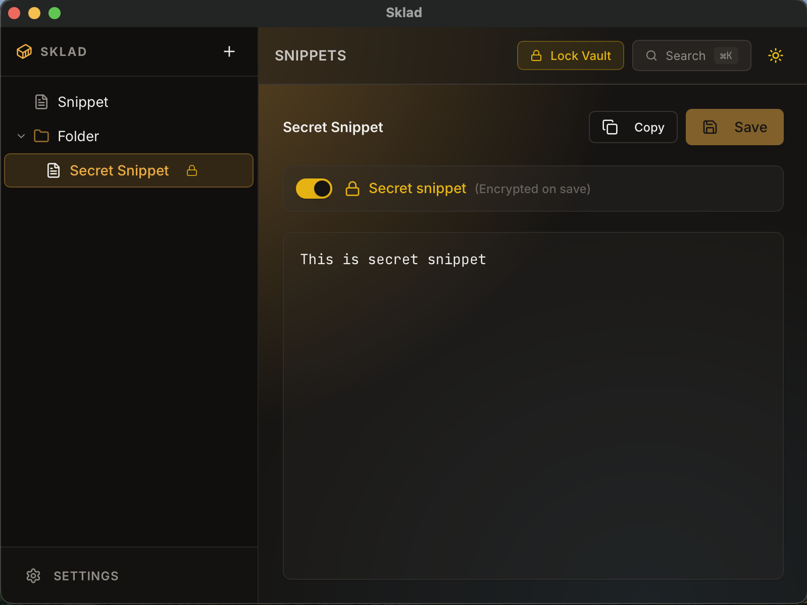

# Sklad 📦

[](https://github.com/Rench321/sklad/releases)
[](LICENSE)
[]()
[](https://www.rust-lang.org/)

**Sklad** is a cross-platform snippet manager that lives in your system tray. Store passwords, API keys, code snippets, and any text you copy frequently — encrypted and always one click away.

<p align="center">
  
</p>

---

## ✨ Features

- 🔒 **Master Password Protection** — Secrets are AES-256 encrypted with Argon2 key derivation
- 📋 **One-Click Copy** — Click tray → select snippet → done
- 🔍 **Quick Search** — Find anything instantly with `Cmd/Ctrl+K`
- 📁 **Folder Organization** — Organize snippets into nested folders
- 🌙 **Dark/Light Theme** — Easy on the eyes
- 💾 **Local-Only Storage** — Your data never leaves your machine
- 🖱 **Left-Click Quick Copy** — Left-click tray to copy last used snippet

<p align="center">
  
</p>

---

## ⬇️ Download

[](https://github.com/Rench321/sklad/releases)

> [!NOTE]
> 🚧 **Early Access** — Sklad is in active development. Expect bugs and breaking changes.

| Windows | macOS (Apple Silicon) | macOS (Intel) | Linux |
|:-------:|:---------------------:|:-------------:|:-----:|
| [📦 .msi](https://github.com/Rench321/sklad/releases) | [📦 .dmg (ARM)](https://github.com/Rench321/sklad/releases) | [📦 .dmg (x64)](https://github.com/Rench321/sklad/releases) | [📦 .deb](https://github.com/Rench321/sklad/releases) |

> [!WARNING]
> **Windows users:** You may see a SmartScreen warning because the app is not code-signed yet and has few downloads. Click *"More info"* → *"Run anyway"* to proceed.

> [!WARNING]
> **macOS users:** The app is not notarized yet (requires Apple Developer account).  
> If you see *"Sklad is damaged"*, open Terminal and run:
> ```bash
> xattr -cr /Applications/Sklad.app
> ```

---

## Why Sklad?

| Feature | Sklad | Maccy | Text File |
|---------|:-----:|:-----:|:---------:|
| 🔐 Encrypted secrets | ✅ | ❌ | ❌ |
| 🦀 Memory safe (Rust) | ✅ | ✅ | N/A |
| 🖥 Cross-platform | ✅ | ❌ Mac only | ✅ |
| ☁️ No cloud/tracking | ✅ | ✅ | ✅ |
| 📁 Folder organization | ✅ | ❌ | ❌ |
| 🔍 Fast search | ✅ | ✅ | ❌ |
| 🖱 System tray access | ✅ | ✅ | ❌ |

---

## 🛠 Build from Source

### Prerequisites

- [Rust](https://rustup.rs/)
- [Node.js](https://nodejs.org/) (v18+)
- [pnpm](https://pnpm.io/)

<details>
<summary><b>Windows</b></summary>

Install [Visual Studio Build Tools](https://visualstudio.microsoft.com/visual-cpp-build-tools/) with "Desktop development with C++" workload.
</details>

<details>
<summary><b>Linux (Debian/Ubuntu)</b></summary>

```bash
sudo apt install libwebkit2gtk-4.1-dev libappindicator3-dev librsvg2-dev
```
</details>

<details>
<summary><b>macOS</b></summary>

```bash
xcode-select --install
```
</details>

### Build

```bash
git clone https://github.com/Rench321/sklad.git
cd sklad
pnpm install
pnpm tauri build
```

Binaries will be in `src-tauri/target/release/bundle/`.

---

## 🤝 Contributing

Contributions are welcome! Feel free to open issues or submit PRs.

---

## 📄 License

[MIT](LICENSE) — Use it however you want.

---

<p align="center">
  Made with 🦀 Rust + ⚛️ React + 💙 Tauri
</p>
